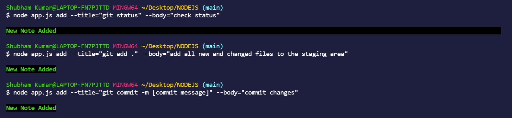
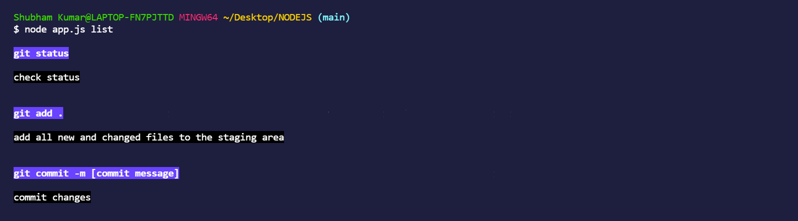
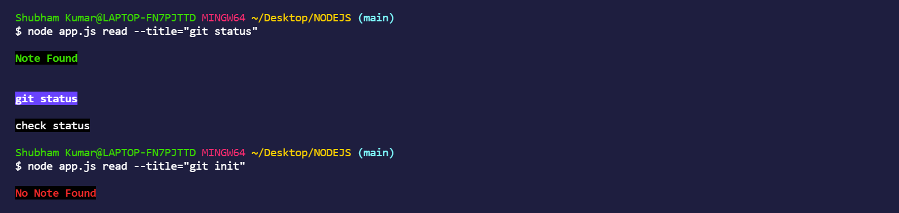
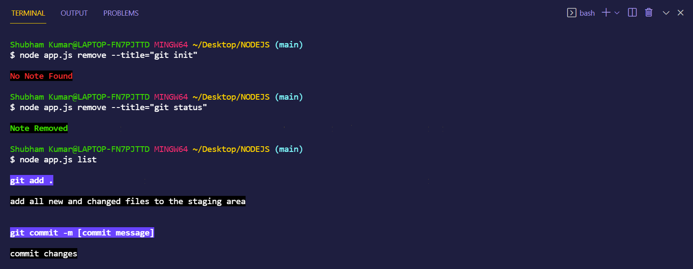
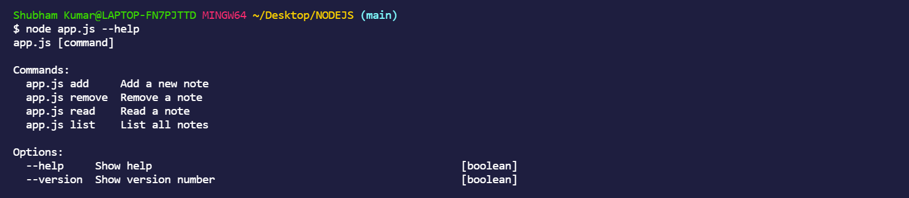

# notes_CLI
##### node.js project
 

notes_CLI is a command line application for managing notes :
1. Adding a note
2. Reading a note
3. Listing all notes
4. Removing a note

The required command to perform these operations are provided through command line arguments. It uses yargs npm module to parse command line arguments and chalk npm module to display styled texts.

 

## Tutorial
1. Add a note : node app.js add --title="[text]" --body="[text]"

 
 

2. List all notes : node app.js list

 
 

3. Read a note : node app.js read --title="[text]"

 

4. Remove a note : node app.js remove --title="[text]"

 

5. Display help about all commands : node app.js --help

